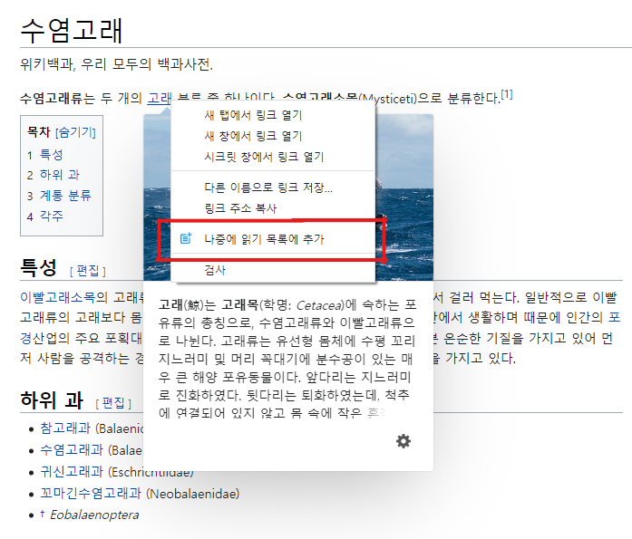

**ENGLISH BELOW**

# 나중에 위키 읽기 #

위키 사이트를 이용하다보면 읽고 싶은 문서가 많아서 미리 여러 탭을 띄워두는 경우가 많습니다.

지나치게 많은 탭을 띄운 탓에 브라우저가 느려져서 일부 탭을 닫을 수 밖에 없는 경우도 있습니다. 또한 닫아버린 문서를 기억해내지 못해서 읽지 못하는 경우도 있습니다.

**나중에 위키 읽기** 확장을 이용하면 더 이상 탭을 많이 열 필요도, 보려고 했던 문서를 잊어먹을 염려도 없습니다.

## 기능 ##

보고 싶은 문서에 마우스를 대고 우클릭을 하면 나오는 메뉴를 누르면 읽기 목록에 바로 추가됩니다.

읽기 목록은 화면 아래에 표시되고, 문서 제목을 클릭하면 해당 문서로 이동하고, 옆의 × 버튼을 누르면 읽기 목록에서 삭제할 수 있습니다.

[화면의 문서 - 한국어 위키백과 수염고래 문서](https://ko.wikipedia.org/wiki/%EC%88%98%EC%97%BC%EA%B3%A0%EB%9E%98)

## 지원하는 위키 ##

* 위키백과 (모든 언어)
* 나무위키

지원하는 위키는 계속 추가될 예정입니다.

## 개발과 기여 ##

소스코드는 **GPLv3**로 배포됩니다.

모든 형태의 기여를 환영합니다.

새로운 위키 사이트를 추가하고 싶다면 [새로운 위키 사이트 추가하기](doc/HowToAddNewSite.md)를 참고해주세요.

# Read Wiki Later

When you use a wiki site, there are many documents you want to read, so you often have several tabs in advance.

Sometimes your browser slows down due to too many tabs, forcing you to close some. In some cases, you may not be able to remember the closed document and read it.

With this extension, you don't have to open as many tabs anymore, and you don't have to worry about forgetting what you've been looking at.

## Features ##

Right-click the document you want to view, and then click the menu that appears to add it to the reading list immediately.

The reading list is displayed at the bottom of the screen, and you can click the title of the document to go to it, and you can click the x button next to it to delete it from the reading list.

[Document of Screenshots - English Wikipedia Baleen Whale](https://en.wikipedia.org/wiki/Baleen_whale)

## Supported Wiki sites ##

* Wikipedia (All languages)
* NamuWiki (Korean)

## Contribution ##

Source code is distributed in **GPLv3**.

We welcome all forms of contribution.

If you want to add new wiki sites, see [Add new wiki site]((doc/HowToAddNewSite.md)).